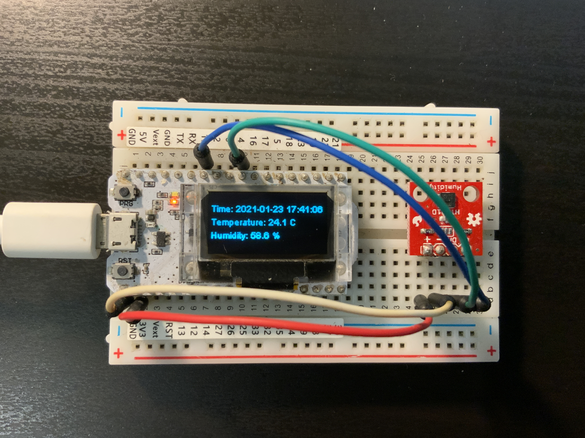

# ESP32 IoT with HTU21d and MQTT

A low-power IoT sensing device using ESP32 + HTU21D. Supports to display sensory data on an OLCD screen and submit data to a MQTT server.

## Requirements

- Install Arduino IDE.
- Install ESP32 board support (https://github.com/espressif/arduino-esp32/blob/master/docs/arduino-ide/boards_manager.md).
- (optional) Install Adafruit MQTT Library in the Arduino library manager.

## Hardware

I am using the WiFi Kit 32, a ESP32 development board from HELTEC. Other ESP32 boards should also work, but may need to manually connect to an external LCD.

The HTU21D sensor and the OLED display are connected via IIC.  

## Usage

Simply open the Arduino project. Change the WiFi parameters at the beginning of the code and download the firmware to the ESP32 board.

## Credit

This project is based on the following libraries:

- HTU21D driver is from Sparkfun.
- OLED driver is from ThingPulse.
- MQTT driver is from Adafruit.
